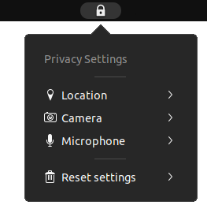

  

## Privacy Quick Settings GNOME Extension
  - Add privacy quick settings to the system menu for quick access to privacy settings in GNOME
    - Supports GNOME 45+
  - Get the extension from [here](https://extensions.gnome.org/extension/4491/privacy-settings-menu/)
  - This project is licensed under GPL 3.0
  - Any donations are greatly appreciated :)

## Why are apps ignoring my settings?
 - Due to limitations in GNOME shell, only sandboxed (flatpak / snap) apps can be forced to respect privacy settings
 - As long as the settings changed by the extension match the settings inside GNOME Settings (privacy section), the extension is behaving correctly

## Older versions:
  - Support for older versions of GNOME can be found in branches
  - Find the name of the branch thgat supports the target version, and install from there
  - Alternatively, you can just use an older release or tag to install from

## Install the extension from releases:
  - Run `gnome-extensions install "PrivacyMenu@stuarthayhurst.shell-extension.zip" --force`
  - Alternatively:
    - Extract the zip to `~/.local/share/gnome-shell/extensions/PrivacyMenu@stuarthayhurst/`
    - Then run `glib-compile-schemas ~/.local/share/gnome-shell-extensions/PrivacyMenu@stuarthayhurst/schemas/`
  - Log out and back in to restart GNOME
  - Enable the extension: `gnome-extensions enable PrivacyMenu@stuarthayhurst`

## Install the extension from source:
  - Make sure the install dependencies are installed
  - `make build`
  - `make install`
  - Log out and back in to restart GNOME
  - Enable the extension: `gnome-extensions enable PrivacyMenu@stuarthayhurst`

## Build system usage:
  - ### Common targets: Regular build system targets to build, install and uninstall
    - `make build`: Creates extension zip
    - `make check`: Runs checks on built extension zip
    - `make install`: Installs the extension
    - `make uninstall`: Uninstalls the extension
  - ### Development targets: These targets are aimed at developers and translators
    - `make clean`: Cleans the extension repository, including built files and translations
    - `make translations`: Updates translations
    - `make compress`: Losslessly compresses any `.png`s in `docs/`
      - Allows passing `COMPRESSLEVEL="-o[X]"`, where `[X]` is an integer between 0-7
      - Supports `-j[X]`, where `[X]` is the number of threads to use
    - `make release`: Updates translations and icons, then creates and checks an extension zip
      - Calls `make translations compress build check`
      - Supports any variables / arguments supported by these targets
      - Also allows passing `VERSION="[XX]"`, where `[XX]` is the version to update `metadata.json` to
      - Supports `-j[X]`, where `[X]` is the number of threads to use
    - `make package`: Creates the extension zip from the project's current state (only useful for debugging)

## Install dependencies:
  - gettext
  - gnome-extensions

## Build dependencies: (Only required if running `make release`)
  - `All install dependencies`
  - sed (`make translations`)
  - optipng (`make compress`)

## Want to help?
  - Help with the project is always appreciated, refer to `docs/CONTRIBUTING.md` to get started
  - [Documentation](docs/CONTRIBUTING.md#documentation-changes), [code](docs/CONTRIBUTING.md#code-changes), [translations](docs/CONTRIBUTING.md#translations) and UI improvements are all welcome!

## Bug reporting / debugging:
  - If you were simply told "Error" while installing, reboot and see if there's still an issue
    - When installing an extension from GNOME's extension site, this is normal
  - A log of what the extension is doing is very helpful for fixing issues
  - The extension logs to the system logs when enabled, which can be accessed with `journalctl /usr/bin/gnome-shell`
  - A live feed of GNOME's logs can be accessed with `journalctl /usr/bin/gnome-shell -f -o cat`

### Credits:
  - `scripts/update-po.sh` and `scripts/update-pot.sh` were derived from [Fly-Pie](https://github.com/Schneegans/Fly-Pie), originally licensed under the [MIT License](https://github.com/Schneegans/Fly-Pie/blob/develop/LICENSE)

### Screenshot:

